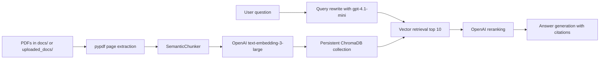

# RAG Knowledge Assistant

A polished, portfolio-ready conversational RAG system built with Python, Streamlit, OpenAI, and persistent ChromaDB.

The app lets you upload PDFs, ingest them into a local vector database, ask conversational questions, receive grounded answers with inline source citations, inspect the sources used, and review behind-the-scenes retrieval details.

## Architecture



## Features

- Streamlit SaaS-style UI inspired by the provided RAG product screenshots.
- Persistent local ChromaDB at `chroma_db/`.
- Multiple PDF upload and ingestion.
- Duplicate prevention using SHA-256 document hashes.
- Page-level PDF extraction with `pypdf`.
- Semantic chunking with LangChain `SemanticChunker`.
- Full adjacent-page overlap during ingestion so chunks can preserve context across page boundaries.
- Fallback recursive character splitting if semantic chunking fails.
- OpenAI `text-embedding-3-large` embeddings.
- OpenAI `gpt-4.1-mini` for query rewriting, reranking, and answers.
- Conversational memory using `st.session_state`.
- Inline citations in the required `[source: filename.pdf, page 4, chunk abc]` format.
- Sources used panel with similarity and rerank scores.
- Behind-the-scenes observability panel.
- Token usage breakdown for query rewriting, retrieval embeddings, reranking, and answer generation.
- CLI ingestion and terminal chat scripts.

## Setup

Create and activate a virtual environment in PowerShell:

```powershell
py -3.12 -m venv .venv
.\.venv\Scripts\Activate.ps1
```

After activation, your prompt should start with `(.venv)`.

If PowerShell blocks activation, allow local scripts for your user account, then activate again:

```powershell
Set-ExecutionPolicy -Scope CurrentUser RemoteSigned
.\.venv\Scripts\Activate.ps1
```

If `py -3.12` is not available, install Python 3.12 from [python.org](https://www.python.org/downloads/) and enable **Add python.exe to PATH** during installation.

Install dependencies:

```powershell
python -m pip install -r requirements.txt
```

Create your environment file:

```powershell
copy .env.example .env
```

Then edit `.env`:

```text
OPENAI_API_KEY=your_openai_api_key_here
```

Do not commit `.env`. It is ignored by Git.

## Add PDFs

You have two options:

- Put PDFs in `docs/` for terminal ingestion.
- Upload PDFs through the Streamlit Documents page, which saves them into `uploaded_docs/`.

## Ingest Documents

From the terminal:

```powershell
python ingest.py
```

From the app:

```powershell
python -m streamlit run app.py
```

Open the Documents section, upload PDFs if needed, then click **Ingest uploaded and docs folder**.

The app uses full adjacent-page overlap during ingestion so chunks can preserve context across page boundaries.

## Run the App

```powershell
python -m streamlit run app.py
```

The app loads the existing `rag_docs` collection from `chroma_db/`, so documents do not need to be re-ingested after every restart.

Because the embedding model changed, the local ChromaDB index should be reset and documents re-ingested.

## Deploy on Streamlit Community Cloud

Use `app.py` as the Streamlit main file path. Select Python `3.12` if it is available.

Add these required Streamlit Cloud secrets:

```toml
OPENAI_API_KEY="your_openai_api_key_here"
RAG_STORAGE_MODE="session"
```

Do not commit `.env` or `.streamlit/secrets.toml`. The OpenAI key is used server-side and should never be shown in the UI.

Public Streamlit deployment uses temporary session-isolated uploaded docs and ChromaDB storage. Each visitor uploads and ingests their own PDFs, and documents are not intended to persist permanently in Streamlit Community Cloud demo mode.

Local development remains unchanged by default: it uses persistent local `chroma_db/`, `uploaded_docs/`, `docs/`, and the `rag_docs` collection. For production-grade persistence later, add authentication plus hosted file storage and a hosted vector database.

## Terminal Chat

After ingestion:

```powershell
python chat.py
```

Type `exit` to stop.

## How Conversational RAG Works

1. The user asks a question.
2. Recent chat history is used to rewrite follow-up questions into standalone queries.
3. The standalone query is embedded with `text-embedding-3-large`.
4. ChromaDB retrieves the top 10 similar chunks.
5. `gpt-4.1-mini` reranks those chunks for relevance.
6. The top chunks are sent to the answer prompt.
7. The model must answer only from retrieved context and cite sources inline.

## API Key Safety

Secrets belong in `.env`, never in code. The repository includes `.env.example` as a template and ignores `.env`.

## Cost Expectations

Costs depend on document size and question volume. Ingestion uses embeddings for semantic chunking and storage. Each chat turn uses query rewriting, retrieval embedding, reranking, and answer generation.

For early testing, start with a few short PDFs.

## Troubleshooting

- **Missing API key:** Create `.env` from `.env.example` and add `OPENAI_API_KEY`.
- **No answers:** Make sure PDFs have been ingested and `chroma_db/` contains a collection.
- **No extractable text:** Some PDFs are scanned images. Add OCR before ingestion if needed.
- **Duplicate skipped:** The exact same PDF hash is already indexed.
- **Semantic chunking failed:** The code automatically falls back to recursive character splitting.

## Project Structure

```text
rag-system/
├── docs/
├── uploaded_docs/
├── chroma_db/
├── app.py
├── ingest.py
├── chat.py
├── rag_utils.py
├── ui_components.py
├── requirements.txt
├── .env.example
├── .gitignore
└── README.md
```

`uploaded_docs/` and `chroma_db/` are created locally and ignored by Git.
